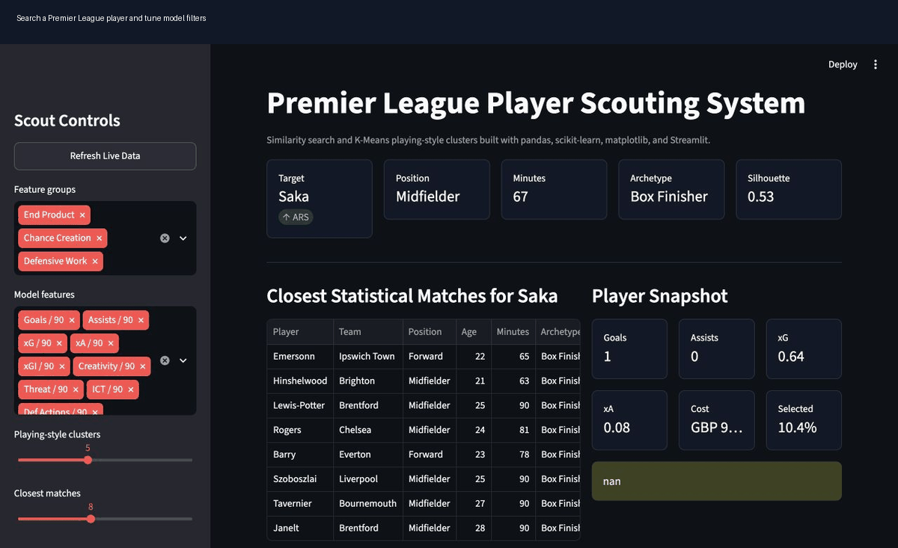

# Premier League Player Scouting System

A Streamlit dashboard that compares Premier League players by statistical playstyle. The app standardizes player per-90 metrics, computes cosine-similarity matches, and uses K-Means clustering to group players into tactical archetypes.

[](https://www.python.org/)
[](https://pandas.pydata.org/)
[](https://scikit-learn.org/)
[](https://matplotlib.org/)
[](https://streamlit.io/)
[](https://opensource.org/licenses/MIT)



## Features

- Live data refresh from the public Fantasy Premier League bootstrap API
- Player search with a Bukayo Saka default when available
- Cosine-similarity engine for closest statistical matches
- K-Means playing-style clusters with interpretable archetype labels
- Radar chart comparison using league percentile profiles
- PCA cluster map to visualize player style neighborhoods
- Filters for minimum minutes, same position, and same archetype
- Source metadata saved with every data refresh

## Tech Stack

- Python
- pandas
- scikit-learn
- matplotlib
- Streamlit

## Project Structure

```text
.
├── app.py                    # Streamlit dashboard
├── scout_model.py            # Feature prep, similarity, clustering, PCA
├── fetch_real_data.py        # Live data ingestion and feature engineering
├── premier_league_stats.csv  # Current local player dataset
├── data_metadata.json        # Source and refresh metadata
└── requirements.txt
```

## Run Locally

```bash
python -m venv venv
source venv/bin/activate
pip install -r requirements.txt
python fetch_real_data.py
streamlit run app.py
```

## Modeling Approach

The model uses per-90 rate features so players with different minutes can be compared more fairly. Features are standardized with `StandardScaler`, then:

- `cosine_similarity` ranks closest player profiles.
- `KMeans` groups players into playing-style clusters.
- `PCA` projects the feature vectors into two dimensions for the cluster map.
- Cluster labels are generated from each cluster's strongest relative features.

## Data Notes

The included dataset was refreshed from the Fantasy Premier League public API. FPL provides strong current player metadata and season-to-date totals for goals, assists, expected goal involvement, ICT creativity/threat/influence, tackles, recoveries, defensive contribution, price, ownership, minutes, and availability.

Passing, shot, and dribble event detail are approximated with FPL's Creativity, Threat, ICT, and defensive-action feature groups. For a production scouting department version, this project is designed so richer event data from StatsBomb, Opta, Wyscout, or FBref-style tables can replace or extend `fetch_real_data.py`.
